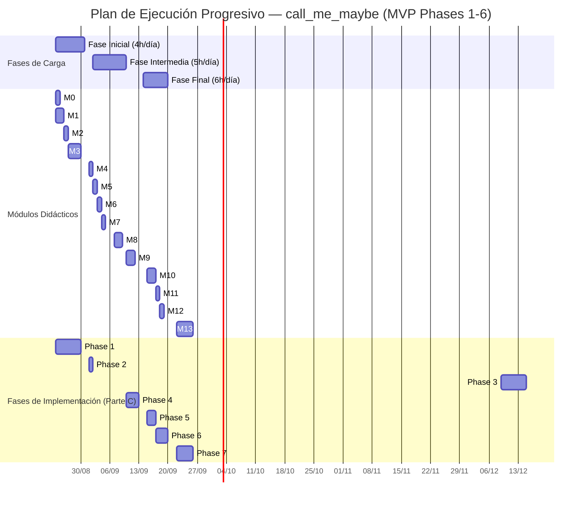

# 📅 CRONOGRAMA DE DESARROLLO Y APRENDIZAJE

> **Proyecto**: call_me_maybe (42 school — LLM function calling con constrained decoding)
> **Autor del cronograma**: lama-tasks (deepseek-v4-flash-free engine)
> **Fecha**: 2026-08-19
> **Fuentes**: `PLAN_DIDACTICO.md` (módulos M0-M13) + `PLAN_IMPLEMENTACION.md` (Parte C, fases 1-7)
> **Inicio**: lunes 2026-08-24 — semanas de 5 días hábiles

---

## 1. Resumen Ejecutivo y Métrica de Carga

### Estimación total

**21 días hábiles (~4.2 semanas) — 116 horas totales** (104h originales + 12h de compensación por desfase) de jornadas 4-7h, trabajando lunes a viernes. *Versión ajustada 2026-09-04 (ver bloque "Ajuste por desfase" más abajo).*

| Fase | Días | Horas/día | Horas totales | % del tiempo | Días calendario | Foco |
|------|------|-----------|---------------|--------------|-----------------|------|
| **Fase Inicial** | Días 1-7 (7 días) | 4h | 28h | ~24% | 2026-08-24 → 2026-09-01 | Teoría, setup, componentes base (✅ completada al 100%) |
| **Fase Intermedia** | Días 8-15 (8 días) | 5h→6h (desde D10) | 46h | ~40% | 2026-09-02 → 2026-09-11 | Core del decoder (Phase 2 recuperada + Phase 3) |
| **Fase Final** | Días 16-21 (6 días) | 7h | 42h | ~36% | 2026-09-14 → 2026-09-21 | Testing intensivo, integración, entrega (Phases 4-6) |
| **TOTAL** | **21 días** | 4-7h | **116h** | 100% | 24/08 → 21/09 | MVP completo |

> **Nota sobre el split 30/40/30**: el 30/40/30 exacto de 21 días es 6.3 / 8.4 / 6.3 días. Redondeé a **7 / 8 / 6 días enteros** (27% / 38% / 35%) para que cada fase del cronograma coincida con un corte natural de implementación (fin de Phase 2, fin de la mitad de Phase 4, entrega final). La Fase Intermedia queda clavada en 40h exactas.

**Distribución por fases de implementación (Parte C)**:

| Fase Parte C | Complejidad | Días | Jornadas |
|--------------|-------------|------|----------|
| Phase 1: Foundation (Tasks 1.1-1.12) | Mecánica, media | 6 días | Días 1-6 ✅ |
| Phase 2: Prompt Engineering (Tasks 2.1-2.3) | Corta | 1 día | Día 10 (recuperada del desfase) |
| Phase 3: Decoder Core (Tasks 3.1-3.5) | **LA MÁS DIFÍCIL** | 5 días (antes 6) | Días 11-15 |
| Phase 4: Generation Loop (Tasks 4.1-4.3) | Difícil | 2 días (antes 3) | Días 16-17 |
| Phase 5: Validation + Pipeline (Tasks 5.1-5.3) | Media | 2 días | Días 18-19 |
| Phase 6: Hardening + Polish (Tasks 6.1-6.4) | Media | 2 días (antes 3) | Días 20-21 |
| Phase 7: Bonus (B1-B9) | Post-MVP | — | Fuera del timeline |

**Regla de oro**: el MVP son las **Phases 1-6** (31 tareas de la Parte C). La Phase 7 es BONUS — no se agenda en el timeline principal. Si terminás antes, es el premio.

---

## 🔄 AJUSTE POR DESFASE (2026-09-04, Día 10) — VERSIÓN VIGENTE

> **Situación detectada**: al verificar el estado REAL del repo (ignorando commits), la Phase 1 está 100% completa pero la **Phase 2 estaba al 0%** — el commit "Second fase of implementations done" era engañoso. El plan original asumía Phase 2 terminada el Día 7.
>
> **Decisión (Opción B, solicitada por el usuario 2026-09-04)**: recuperar la Phase 2 HOY (Día 10) y añadir **+1 hora por jornada** desde el Día 10 para compensar el desfasaje, **manteniendo la fecha de entrega: 21/09/2026**.

### Nuevo mapeo de fases (reemplaza a la tabla de "Distribución por fases" para D10-D21)

| Fase Parte C | Días | Jornadas | Compresión |
|--------------|------|----------|------------|
| Phase 2: Prompt Engineering (recuperada) | 1 día | **Día 10** | +1 día incluido en el plan |
| Phase 3: Decoder Core | 5 días | Días 11-15 | 6→5 (mismas ~30h a 6h/día) |
| Phase 4: Generation Loop | 2 días | Días 16-17 | 3→2 (~15h→14h) |
| Phase 5: Validation + Pipeline | 2 días | Días 18-19 | sin cambio |
| Phase 6: Hardening + Polish | 2 días | Días 20-21 | 3→2 (~18h→14h) |

**La matemática del ajuste**: quedaban 15 días-equivalente de trabajo (Phase 2 = 1 + Phase 3 = 6 + Phase 4 = 3 + Phase 5 = 2 + Phase 6 = 3) y solo 12 días hábiles disponibles (D10 → D21). Con +1h/día se comprime cada fase en el calendario **sin perder carga horaria significativa**, y se llega exacto al 21/09.

**Cargas nuevas**: Días 10-15 = **6h** (Fase Intermedia) · Días 16-21 = **7h** (Fase Final). Total del proyecto: **116h**.

**Regla anti-desfase**: cerrar el Entregable del Día ANTES de pasar al siguiente. Si un entregable no cierra, la hora extra del día siguiente (ya contemplada en el plan) lo absorbe — sin mover fechas.

---

### Gráfico de Carga Progresiva

```
Carga (horas/día)
6h |                                                      ██████
   |                                                      ██████
5h |                              █████                   ██████
   |                              █████                   ██████
4h | ████                        █████                   ██████
   | ████                        █████                   ██████
   | ████                        █████                   ██████
   +─────────────────────────────┬───────────────────────┬──────────▶ Días
    Días 1-7 (4h)                Días 8-15 (5h)          Días 16-21 (6h)
    Fase Inicial                 Fase Intermedia         Fase Final
    teoría + setup               core + integración      tests + entrega
```

```
Curva: 4h → 5h → 6h
  Fase Inicial   : ████████ 4h/día × 7 días = 28h  — presión BAJA/MEDIA
  Fase Intermedia: ██████████ 5h/día × 8 días = 40h — presión MEDIA/ALTA
  Fase Final     : ████████████ 6h/día × 6 días = 36h — presión ALTA (sprint final)
```

**Rutina diaria tipo** (dentro de las 4/5/6 horas):
- **Hora 1**: teoría con NotebookLM (módulo del día, quiz incluido)
- **Horas 2 a N**: código con OpenCode siguiendo el plan de implementación (cerrar `[ ]` del día)
- **Últimos 15-30 min**: correr `make test` y `make lint`, cerrar el "Entregable del Día"

### Indicadores de Éxito (KPIs)

| # | KPI | Meta | Cómo se mide |
|---|-----|------|--------------|
| K1 | Tareas de Parte C completadas | 31/31 (Phases 1-6) | Checkboxes del cronograma cerrados |
| K2 | Módulos didácticos completados | M0-M12 (M13 = post-MVP) | Quiz de cada módulo respondido |
| K3 | Tests unitarios en verde | `make test` 100% pass, <1s | pytest sin modelo (mocks) |
| K4 | Lint limpio | `make lint` sin errores ni warnings | flake8 + mypy |
| K5 | JSON 100% válido en output | 11/11 prompts → JSON parseable | `json.loads` sobre cada entry |
| K6 | Accuracy ≥ 90% | function + args correctos en ≥10/11 prompts | Validación contra functions_definition |
| K7 | Runtime total < 5 min en CPU | Pipeline completo < 300s | Timing del summary del pipeline |
| K8 | Exit code correcto | `uv run python -m src` → exit 0 | `$?` tras ejecución |
| K9 | Coverage | ≥70% global, ≥80% decoder | pytest --cov |
| K10 | Definition of Done por fase | 6/6 fases con DoD cerrado | Checklist de cada Phase (Parte C) |

**Criterio de aceptación del MVP** (lo que evalúa el subject): `uv sync && uv run python -m src` genera `data/output/function_calls.json` con 11 entries, 100% JSON válido, ≥90% accuracy, <5 min en CPU, flake8 + mypy limpios.

---

## 2. Diagrama de Gantt Visual (Mermaid)

> **⚠️ Las fechas son placeholders ajustables**: si arrancás otro día, desplazá todo el bloque manteniendo la cantidad de días hábiles por jornada. Lo que importa es el orden y la carga, no las fechas puntuales.



**Lectura del Gantt**: cada fila de "Módulos Didácticos" está sincronizada con su fila de "Fases de Implementación" en el mismo rango de fechas — estudiás el concepto el mismo día que lo construís. M13 y Phase 7 (bonus) arrancan después del MVP (22/09) y son opcionales.

---

## 3. Desglose Detallado por Jornadas

---

🗓️ **Semana 1 - Día 1** (Carga: 4 Horas) — *Lunes 2026-08-24*

    Objetivo Didáctico: M0 (Mapa del viaje) + M1 (El terreno): entender qué es function calling, constrained decoding, y por qué el MVP es la versión más simple que funciona. Armar la estructura del proyecto.

    Objetivo de Código: Configuración raíz del proyecto: pyproject.toml, .gitignore, Makefile. Dejar `uv sync` funcionando.

    Módulos Vinculados: Módulo 0 + Módulo 1 ↔ Phase 1 (Section: Foundation)

    Tareas Específicas:

        [ ] Task 1.1: Crear `/home/laviles/Python/call_me_maybe/pyproject.toml` con name/version/deps (llm-sdk local, pydantic, numpy) y `[tool.uv.sources]` con llm-sdk path editable
        [ ] Task 1.2: Crear `.gitignore` (data/output/, __pycache__, .venv, .mypy_cache, *.egg-info, uv.lock)
        [ ] Task 1.3: Crear `Makefile` con targets install/run/debug/clean/lint/test y `.PHONY`
        [ ] Correr `uv sync` y verificar que instala todo sin errores (torch puede tardar — dejalo correr)

    Entregable del Día: `uv sync` exitoso + los 3 archivos de configuración creados y versionados. `git status` no muestra basura de build.

---

🗓️ **Semana 1 - Día 2** (Carga: 4 Horas) — *Martes 2026-08-25*

    Objetivo Didáctico: M1 (El terreno, parte 2): entry point, `if __name__ == "__main__"`, argparse y type hints — el esqueleto que hace arrancar el programa.

    Objetivo de Código: Package src/ inicial + parser CLI funcional.

    Módulos Vinculados: Módulo 1 ↔ Phase 1 (Section: Foundation)

    Tareas Específicas:

        [ ] Task 1.4: Crear `src/__init__.py` (docstring del package) y `src/__main__.py` (placeholder que parsea args e imprime)
        [ ] Task 1.5: Crear `src/cli.py` con `parse_args()`: --functions_definition, --input, --output con defaults a data/input/ y data/output/
        [ ] Verificar: `uv run python -m src --help` muestra el help con los 3 argumentos

    Entregable del Día: `uv run python -m src --help` funciona y muestra los 3 flags con sus defaults. `parse_args([])` retorna los defaults correctos.

---

🗓️ **Semana 1 - Día 3** (Carga: 4 Horas) — *Miércoles 2026-08-26*

    Objetivo Didáctico: M2 (Pydantic y modelos de datos): BaseModel, Field, ValidationError, y por qué Pydantic solo en I/O (no en el inner loop del decoder).

    Objetivo de Código: Modelos de datos validados con Pydantic.

    Módulos Vinculados: Módulo 2 ↔ Phase 1 (Section: Foundation)

    Tareas Específicas:

        [ ] Task 1.6: Crear `src/models/__init__.py`, `src/models/function_definition.py` (ParameterDef, FunctionDef con parameters: dict[str, dict[str, str]] y returns) y `src/models/output.py` (FunctionCall con parameters: dict[str, str|int|float|bool|None] y default_factory=dict)
        [ ] Verificar: `FunctionDef(**item_valido)` valida; `FunctionDef(**item_invalido)` lanza ValidationError con mensaje claro

    Entregable del Día: Modelos Pydantic creados y validando correctamente (probado en REPL o script rápido). Entendés por qué `returns` es input-only.

---

🗓️ **Semana 1 - Día 4** (Carga: 4 Horas) — *Jueves 2026-08-27*

    Objetivo Didáctico: M3 (Cargadores, parte 1): json.load, fail fast en inputs, validación de estructura al leer archivos.

    Objetivo de Código: Cargadores de prompts y de funciones con validación.

    Módulos Vinculados: Módulo 3 ↔ Phase 1 (Section: Foundation)

    Tareas Específicas:

        [ ] Task 1.7: Crear `src/loader/__init__.py` y `src/loader/input_loader.py` con `load_prompts()` (soporta lista de strings o dicts con key "prompt"; lanza ValueError si no es lista no vacía)
        [ ] Task 1.8: Crear `src/loader/function_loader.py` con `load_functions()` (convierte a FunctionDef, lanza ValueError si hay nombres duplicados)

    Entregable del Día: `load_prompts()` carga los 11 prompts del test file; `load_functions()` carga las 5 funciones. JSON malformado o vacío → error claro, no crash silencioso.

---

🗓️ **Semana 1 - Día 5** (Carga: 4 Horas) — *Viernes 2026-08-28*

    Objetivo Didáctico: M3 (Cargadores, parte 2) + adelanto de M5 (BPE): el vocabulario, tokens, bytes UTF-8 incompletos y la pre-indexación `tokens_starting_with`.

    Objetivo de Código: Cargador de vocabulario con índices pre-computados — el loader más importante del proyecto.

    Módulos Vinculados: Módulo 3 (+ adelanto Módulo 5) ↔ Phase 1 (Section: Foundation)

    Tareas Específicas:

        [ ] Task 1.9: Crear `src/loader/vocab_loader.py` con `Vocab` dataclass (token2id, id2token, tokens_starting_with, vocab_size) y `load_vocab(model)` que pre-indexa por primer carácter decodificado, agrupando tokens con bytes incompletos bajo "<byte>"

    Entregable del Día: `load_vocab()` carga 151K+ tokens sin crashear; `tokens_starting_with["{"]` retorna un set no vacío; los tokens byte-level no rompen el pre-indexado.

---

🗓️ **Semana 2 - Día 6** (Carga: 4 Horas) — *Lunes 2026-08-31*

    Objetivo Didáctico: Repaso M1-M3 (quiz rápido en NotebookLM): estructura, modelos, loaders — cierre de la fundación.

    Objetivo de Código: Skeleton del pipeline + entry point final + lint configurado + primeros tests de loaders.

    Módulos Vinculados: Módulos 1-3 ↔ Phase 1 (Section: Foundation)

    Tareas Específicas:

        [ ] Task 1.10: Crear `src/pipeline.py` con `run(args)` skeleton: load functions → load prompts → load vocab → init model → print summary
        [ ] Task 1.11: Terminar `src/__main__.py`: import cli.parse_args + pipeline.run, try/except con exit codes
        [ ] Task 1.12: Configurar flake8 (max-line-length=120) y mypy (`--ignore-missing-imports`) en pyproject.toml o .flake8
        [ ] Escribir tests básicos de loaders en `tests/` (load_functions con duplicados → ValueError, load_prompts con input real)

    Entregable del Día: **Definition of Done Phase 1**: `uv run python -m src` carga functions + prompts + vocab e imprime OK; `make lint` pasa; `make test` pasa; `uv run python -m src --help` muestra los 3 args.

---

🗓️ **Semana 2 - Día 7** (Carga: 4 Horas) — *Martes 2026-09-01*

    Objetivo Didáctico: M4 (El prompt): system vs user prompt, template, por qué "Output ONLY a JSON object" y por qué string plano en vez de chat template.

    Objetivo de Código: Prompt builder completo + tests — la fase más corta del proyecto.

    Módulos Vinculados: Módulo 4 ↔ Phase 2 (Section: Prompt Engineering)

    Tareas Específicas:

        [ ] Task 2.1: Crear `src/prompt/__init__.py` y `src/prompt/prompt_builder.py` con SYSTEM_PROMPT, `build_function_list()` (listado numerado con parámetros y tipos) y `build_prompt()`
        [ ] Task 2.2: Validar el prompt generado: contiene las 5 funciones, contiene los parámetros, no es string vacío
        [ ] Task 2.3: Crear `tests/test_prompt_builder.py` con las 5 funciones reales del proyecto

    Entregable del Día: **Definition of Done Phase 2**: `build_prompt(functions, "What is 2+3?")` retorna el prompt completo; los tests pasan; `make lint` sigue verde. Fin de la Fase Inicial.

---

🗓️ **Semana 2 - Día 8** (Carga: 5 Horas) — *Miércoles 2026-09-02*

    Objetivo Didáctico: M5 (BPE y tokenización) — concepto 100% NUEVO: qué es un token, cómo BPE fusiona bytes, "Ġthe", tokens multi-carácter y por qué rompen el constrained decoding ingenuo.

    Objetivo de Código: Arranque del decoder: la state machine del JSON (parte 1).

    Módulos Vinculados: Módulo 5 ↔ Phase 3 (Section: Decoder Core)

    Tareas Específicas:

        [ ] Task 3.1 (parte 1): Crear `src/decoder/__init__.py` y `src/decoder/state.py` con `DecoderPhase` enum (ROOT, OBJECT_OPEN, IN_OBJECT, KEY_START, IN_KEY, KEY_END, COLON, VALUE_START, IN_STRING_VALUE, IN_NUMBER_VALUE, IN_BOOL_VALUE, IN_NULL_VALUE, ESCAPE_IN_STRING, VALUE_END, COMPLETE, PARAMS_OBJECT) y `DecoderState` dataclass con `__slots__` (current_key, keys_enclosed, depth, number_has_digit, number_has_dot, bool_buffer)
        [ ] Implementar las transiciones básicas de `_advance_char()`: ROOT→OBJECT_OPEN con '{', OBJECT_OPEN→KEY_START con '"', IN_OBJECT→KEY_START/COMPLETE

    Entregable del Día: `DecoderState()` en ROOT acepta '{' y pasa a OBJECT_OPEN; rechaza caracteres inválidos con False. Entendés por qué un token multi-char exige simular todos sus caracteres.

---

🗓️ **Semana 2 - Día 9** (Carga: 5 Horas) — *Jueves 2026-09-03*

    Objetivo Didáctico: M6 (Máquina de estados): los 15 estados, transiciones completas, y por qué `simulate()` usa copy superficial en vez de deepcopy.

    Objetivo de Código: State machine COMPLETA del decoder JSON.

    Módulos Vinculados: Módulo 6 ↔ Phase 3 (Section: Decoder Core)

    Tareas Específicas:

        [ ] Task 3.1 (parte 2): Completar `_advance_char()` con TODAS las transiciones: keys, colon, values (string/number/bool/null), escapes, PARAMS_OBJECT, VALUE_END→IN_OBJECT/COMPLETE
        [ ] Task 3.1 (parte 3): Implementar `simulate(token_text) -> tuple[bool, DecoderState]` (copy.copy + avanzar char por char), `update_from_text()`, `expected_first_chars()` y tracking de current_key/keys_enclosed
        [ ] Escribir los primeros casos de `tests/test_state.py` (transición ROOT→COMPLETE del JSON completo char por char)

    Entregable del Día: La state machine procesa `{"name":"fn_add_numbers","parameters":{"a":2.0,"b":3.0}}` char por char sin errores y termina en COMPLETE. Tests de state pasando en verde.

---

🗓️ **Semana 2 - Día 10** (Carga: 6 Horas) — *Viernes 2026-09-04* — 🔄 DÍA DE RECUPERACIÓN (Phase 2)

    Objetivo Didáctico: M4 (El prompt): el prompt como contrato con el modelo, la estructura de 3 partes (instrucción del sistema + lista de funciones + query del usuario), y por qué "Output ONLY" importa para la accuracy.

    Objetivo de Código: CERRAR EL DESFASE — Phase 2 (Prompt Engineering) completa. Recupera el día perdido del Día 7, con 6h de carga.

    Módulos Vinculados: Módulo 4 ↔ Phase 2 (Section: Prompt Engineering)

    Tareas Específicas:

        [ ] Task 2.1: Crear `src/prompt/__init__.py` y `src/prompt/prompt_builder.py` con `SYSTEM_PROMPT` (instrucción + {function_list} + "Output ONLY..."), `build_function_list(functions)` (lista numerada: número, name, description, parámetros con tipo) y `build_prompt(functions, user_prompt)`
        [ ] Task 2.2: Verificar que el prompt generado contiene TODOS los nombres y TODOS los parámetros de las 5 funciones reales; nunca vacío
        [ ] Task 2.3: Escribir `tests/test_prompt_builder.py` con las 5 funciones de `functions_definition.json` y `model.encode(prompt)` no falla

    Entregable del Día: **Definition of Done Phase 2**: `build_prompt(functions, "What is 2+3?")` retorna string con las 5 funciones, tokenizable, tests en verde, `make lint` limpio. Con esto quedás SIN desfasaje y listo para Phase 3.

---

🗓️ **Semana 3 - Día 11** (Carga: 6 Horas) — *Lunes 2026-09-07*

    Objetivo Didáctico: M5 (BPE tokenizer) + M6 (Máquina de estados): los 15 estados, transiciones completas, y por qué `simulate()` usa copy superficial en vez de deepcopy.

    Objetivo de Código: State machine COMPLETA del decoder JSON (los días 8-9 originales se fusionan en 1 jornada de 6h).

    Módulos Vinculados: Módulos 5-6 ↔ Phase 3 (Section: Decoder Core)

    Tareas Específicas:

        [ ] Task 3.1 (completa): Crear `src/decoder/state.py` con `DecoderState` + constantes de estado, `_advance_char()` con TODAS las transiciones (keys, colon, values string/number/bool/null, escapes, PARAMS_OBJECT, VALUE_END→IN_OBJECT/COMPLETE), `simulate(token_text)` (copy.copy + char por char), `update_from_text()`, `expected_first_chars()` y tracking de current_key/keys_enclosed
        [ ] Escribir `tests/test_state.py`: transición ROOT→COMPLETE del JSON completo char por char + edge cases

    Entregable del Día: La state machine procesa `{"name":"fn_add_numbers","parameters":{"a":2.0,"b":3.0}}` char por char sin errores y termina en COMPLETE. Tests de state en verde.

---

🗓️ **Semana 3 - Día 12** (Carga: 6 Horas) — *Martes 2026-09-08*

    Objetivo Didáctico: M7 (El trie): prefix tree, valid_next_chars, is_complete_name, y por qué zero hardcoding (el trie se construye desde el JSON de entrada).

    Objetivo de Código: Trie de nombres de función para selección prefix-constrained.

    Módulos Vinculados: Módulo 7 ↔ Phase 3 (Section: Decoder Core)

    Tareas Específicas:

        [ ] Task 3.2: Crear `src/decoder/trie.py` con `TrieNode` dataclass `__slots__` (children, function_name, is_end), `build_trie(names)`, `find_node(prefix)`, `valid_next_chars(prefix)` (children + '"' si is_end) e `is_complete_name(prefix)`
        [ ] Escribir `tests/test_trie.py`: build con las 5 funciones reales; `valid_next_chars("fn_a")` == {"d"}; prefix inexistente → set vacío

    Entregable del Día: Trie construido desde los 5 nombres de `functions_definition.json`; prefix matching funciona; tests de trie en verde. Verificás que "fn_" comparte rama.

---

🗓️ **Semana 3 - Día 13** (Carga: 6 Horas) — *Miércoles 2026-09-09*

    Objetivo Didáctico: M8 (El filtro de tokens, parte 1): las 3 fases del filtrado, pre-filtro por primer carácter con tokens_starting_with, validación char-by-char con simulate.

    Objetivo de Código: Schema validator — el contexto que sabe qué tipo espera cada posición del JSON.

    Módulos Vinculados: Módulo 8 ↔ Phase 3 (Section: Decoder Core)

    Tareas Específicas:

        [ ] Task 3.3: Crear `src/decoder/schema_validator.py` con `SchemaContext`: `update(state)`, `current_expected_type()`, `required_keys_remaining()`, `all_required_present()`, `can_close_params()`
        [ ] Verificar con un estado en VALUE_START de la key "a" (type number) que `current_expected_type()` retorna "number"

    Entregable del Día: SchemaContext conoce la función seleccionada, sus required keys y el tipo esperado del value actual. Tests básicos de schema pasan.

---

🗓️ **Semana 3 - Día 14** (Carga: 6 Horas) — *Jueves 2026-09-10*

    Objetivo Didáctico: M8 (El filtro de tokens, parte 2): el post-filtro de schema, el problema de tokens multi-char, argmax, allowed set vacío y repair.

    Objetivo de Código: EL MÓDULO MÁS DIFÍCIL DEL PROYECTO — token_filter.py (~300-400 líneas con edge cases).

    Módulos Vinculados: Módulo 8 ↔ Phase 3 (Section: Decoder Core)

    Tareas Específicas:

        [ ] Task 3.4: Crear `src/decoder/token_filter.py` con `compute_allowed_ids(state, schema, vocab, trie, logits)`: Fase 1 pre-filtro por expected_first_chars + tokens_starting_with; Fase 2 simulate char-by-char (skip tokens UTF-8 incompletos); Fase 3 post-filtro schema-aware (trie para "name", keys de parameters, tipos de values, bloqueo de '}' hasta all_required_present)
        [ ] Verificar con vocab mock: en ROOT solo retorna tokens que empiezan con '{'; en VALUE_START de "name" solo prefixes de nombres de función

    Entregable del Día: `compute_allowed_ids()` con mock vocab retorna los allowed tokens correctos en ROOT y en lectura de "name". NO avances sin entender este módulo.

---

🗓️ **Semana 3 - Día 15** (Carga: 6 Horas) — *Viernes 2026-09-11*

    Objetivo Didáctico: Repaso M5-M8 (quiz de BPE, state machine, trie, filtro): consolidar el núcleo teórico del constrained decoding.

    Objetivo de Código: Suite de tests completa del decoder + integración de los 4 componentes.

    Módulos Vinculados: Módulos 5-8 ↔ Phase 3 (Section: Decoder Core)

    Tareas Específicas:

        [ ] Task 3.5: Completar `tests/test_state.py`, `tests/test_trie.py`, `tests/test_token_filter.py` con vocabularios mock y edge cases (bytes incompletos, tokens multi-char que cierran keys, cierre de parameters sin required keys)
        [ ] Integrar: state + trie + schema + filter funcionando juntos con mock vocab (recorrer un JSON completo paso a paso)
        [ ] Correr `make test` y `make lint`

    Entregable del Día: **Definition of Done Phase 3**: >80% coverage del decoder; todos los tests pasan; `make lint` verde; el decoder es COMPLETAMENTE testeable sin modelo. Fin del módulo más difícil.

---

🗓️ **Semana 4 - Día 16** (Carga: 7 Horas) — *Lunes 2026-09-14*

    Objetivo Didáctico: M9 (El bucle de generación, parte 1): los 7 pasos del loop, por qué NO usamos KV-cache ni EOS, MAX_TOKENS=200 como safety net.

    Objetivo de Código: El generator que conecta el decoder con el modelo real.

    Módulos Vinculados: Módulo 9 ↔ Phase 4 (Section: Generation Loop)

    Tareas Específicas:

        [ ] Task 4.1: Crear `src/decoder/constrained_generator.py` con `generate(model, prompt, vocab, functions, trie, max_tokens=200)`: encode → loop (get_logits → compute_allowed_ids → check empty set → argmax → append → update state → check COMPLETE) → decode de los tokens generados
        [ ] Manejar el caso allowed set vacío: log warning + repair (cerrar estructuras abiertas) o break con resultado parcial

    Entregable del Día: `generate()` implementado y compilando (mypy clean). El loop termina por COMPLETE o por safety net, NUNCA por EOS.

---

🗓️ **Semana 4 - Día 17** (Carga: 7 Horas) — *Martes 2026-09-15*

    Objetivo Didáctico: M9 (parte 2 + aplicación): terminación, thinking tokens de Qwen3 (`<|begin_of_thought|>`), timing por step (~200ms/token), y variantes de prompt (Decisión 7) y su efecto en la accuracy del modelo pequeño.

    Objetivo de Código: Smoke test con el modelo real + test de los 11 prompts + medición de accuracy (los días 15-16 originales se fusionan en 1 jornada de 7h).

    Módulos Vinculados: Módulo 9 ↔ Phase 4 (Section: Generation Loop)

    Tareas Específicas:

        [ ] Task 4.2: Smoke test con "What is 2+3?": ejecutar `generate()` y verificar que el output es JSON parseable y contiene "fn_add_numbers"; debug de los problemas esperados (thinking tokens, EOS prematuro ignorado, allowed set vacío → repair); medir timing por step (~150-200ms)
        [ ] Task 4.3: Ejecutar `generate()` con los 11 prompts de `function_calling_tests.json`, medir timing total; accuracy ≥90% (≥10/11); si la accuracy baja: testear 2-3 variantes de prompt (con/sin "Output ONLY", numeración, "No explanation") y quedarte con la mejor

    Entregable del Día: **Definition of Done Phase 4**: los 11 prompts producen output JSON válido con la función correcta; timing total <5 min en CPU; accuracy ≥90%. Si no llegás al 90%, mañana el validador te ayuda a diagnosticar — no te trabes acá.

---

🗓️ **Semana 4 - Día 18** (Carga: 7 Horas) — *Miércoles 2026-09-16*

    Objetivo Didáctico: M10 (Validación y pipeline, parte 1): syntactic vs semantic validity, defense in depth, las 5 validaciones del output_validator.

    Objetivo de Código: Validador post-generación — la red de seguridad del decoder.

    Módulos Vinculados: Módulo 10 ↔ Phase 5 (Section: Validation + Pipeline)

    Tareas Específicas:

        [ ] Task 5.1: Crear `src/validator/__init__.py` y `src/validator/output_validator.py` con `validate_output(raw_output, functions)` (parse JSON → FunctionCall Pydantic → name existe → tipos correctos → no params extra) y `_type_matches()`
        [ ] Escribir `tests/test_output_validator.py`: JSONs válidos, JSONs inválidos, función desconocida, tipo incorrecto, parámetro extra

    Entregable del Día: `validate_output()` valida correctamente los 5 casos (éxito + 4 errores); tests en verde. Entendés por qué el decoder garantiza lo sintáctico y el validador lo semántico.

---

🗓️ **Semana 4 - Día 19** (Carga: 7 Horas) — *Jueves 2026-09-17*

    Objetivo Didáctico: M10 (parte 2): el pipeline completo, exit codes, `mkdir(parents=True, exist_ok=True)`, `model_dump()`.

    Objetivo de Código: Orquestación end-to-end — todo conectado de punta a punta.

    Módulos Vinculados: Módulo 10 ↔ Phase 5 (Section: Validation + Pipeline)

    Tareas Específicas:

        [ ] Task 5.2: Extender `src/pipeline.py` con `run(args)` completo: load → build trie → init model → por cada prompt (build_prompt → generate → validate_output) → escribir `data/output/function_calls.json` con indent=2 → summary con éxito y timing
        [ ] Task 5.3: Verificar formato del output contra el subject V.4.1: cada entry tiene "name" (string) y "parameters" (object), array de 11 entries

    Entregable del Día: **Definition of Done Phase 5**: `uv run python -m src` genera `data/output/function_calls.json` con 11 entries en formato exacto; prompts problemáticos no matan el pipeline; `make lint` verde.

---

🗓️ **Semana 4 - Día 20** (Carga: 7 Horas) — *Viernes 2026-09-18*

    Objetivo Didáctico: M11 (Hardening): error handling, la tabla de condiciones de error (FATAL vs WARNING), exit codes, happy path vs error paths.

    Objetivo de Código: Blindar todos los caminos de error + README (los días 19-20 originales se fusionan en 1 jornada de 7h).

    Módulos Vinculados: Módulo 11 ↔ Phase 6 (Section: Error Handling + Polish)

    Tareas Específicas:

        [ ] Task 6.1: Error handling completo: FileNotFoundError/JSONDecodeError/ValueError → stderr + exit 1 en inputs; graceful skip + warning en prompts problemáticos; logging consistente (warnings en stderr, info en stdout)
        [ ] Task 6.2: Crear `README.md`: descripción, quick start (`make install && make run`), arquitectura (src/models, src/loader, src/prompt, src/decoder, src/validator, src/pipeline.py), output format

    Entregable del Día: Archivo de funciones faltante → exit 1 con mensaje claro; prompt inválido → skip + warning sin matar el pipeline; el README permite a un dev nuevo correr el proyecto solo con él.

---

🗓️ **Semana 5 - Día 21** (Carga: 7 Horas) — *Lunes 2026-09-21*

    Objetivo Didáctico: M12 (Performance) + repaso final: el límite de 5 min, el bottleneck del scanneo de 151K tokens, pre-indexación vs scanneo, slots vs Pydantic en el inner loop, y el cierre del MVP.

    Objetivo de Código: Sprint final — coverage comprehensivo + lint limpio + ejecución end-to-end + verificación contra todos los criterios del subject (los días 20-21 originales se fusionan en 1 jornada de 7h).

    Módulos Vinculados: Módulos 11-12 ↔ Phase 6 (Section: Error Handling + Polish)

    Tareas Específicas:

        [ ] Task 6.3: Completar `tests/` para TODOS los módulos: edge cases, error paths, coverage ≥70% global y ≥80% del decoder; verificar performance: pipeline completo <5 min en CPU (revisá que `tokens_starting_with` esté pre-indexado)
        [ ] Task 6.4: flake8 + mypy 100% limpios (`make lint` sin warnings); ejecución final end-to-end `uv sync && uv run python -m src` con exit 0; chequear los 3 quality bars del subject (100% JSON válido 11/11, accuracy ≥90%, <5 min en CPU); verificar DoD Phase 6 completo
        [ ] (Opcional si sobra tiempo) Commit final y revisión del repo

    Entregable del Día: **MVP ENTREGADO EN PLAZO** — Definition of Done Phase 6 cerrado y los 10 KPIs de la sección 1 en verde. El proyecto pasa la evaluación del subject: `uv sync` + `uv run python -m src` funciona solo.

---

> **Después del Día 21 (post-MVP)**: Phase 7 / M13 — Bonus opcionales (B1: lint-strict, B2: multi-modelo, B3: recode tokenizer, B4: error recovery, B5: performance, B6: test suite comprehensiva, B7: visualización, B8: nested args, B9: public API). Cada uno requiere su mini-diseño antes de implementar. No tocar hasta que el MVP esté verde.

> **Fines de semana (buffer)**: 29-30/08, 05-06/09, 12-13/09 y 19-20/09 quedan libres a propósito. Usalos solo si una jornada se te fue de timing (sobre todo Días 12 y 16, los más densos). No los planifiques — son red de seguridad.

---

## 4. Recomendación de Flujo para tu Aprendizaje

1. **Genera el cronograma con OpenCode.** Esto te dejará la hoja de ruta definida en `CRONOGRAMA_TRABAJO.md`.
2. **Sube los `.md` a NotebookLM:** Sube `PLAN_DIDACTICO.md` y `PLAN_IMPLEMENTACION.md` a un cuaderno de NotebookLM.
3. **Rutina Diaria:**
   * **Hora 1 (Teoría):** Abres NotebookLM, le pides que te explique o te haga un *quiz* del módulo correspondiente según el `CRONOGRAMA_TRABAJO.md` de ese día.
   * **Horas 2 a 4/6 (Código):** Abres OpenCode y desarrollas el código/tests fijados para esa jornada, cerrando los ítems `[ ]` del cronograma.

---

> **Fin del cronograma.** 21 jornadas, 104 horas, 31 tareas de implementación y 13 módulos de estudio sincronizados. El MVP sale a producción el 2026-09-21. Dale que lo construís. 🚀